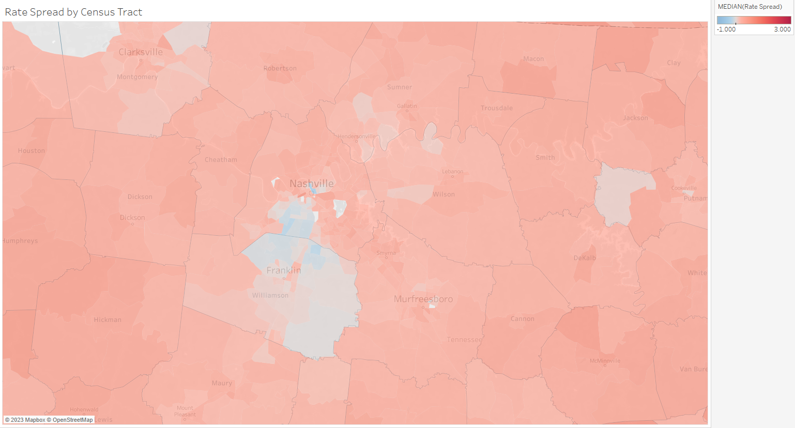

# HMDA Analysis

## Introduction

This projects seeks to analyze 2022 HMDA Loan/Application Records at the census tract level to determine find where there could be geographic discrepancies in lending markets.

## Notable Findings

- Most unusualy low rate census tracts are in Hawaii, Wisconsin, and Pennsylvania
- Low rates in Wisconsin and Pennsylvania seemed to be associated with 1 year introductory rates
- There wasn't a clear explanation for low rates in Hawaii
- Unusually high rates are most common in low income rural areas or small cities
- The worst rates were found in tracts with developments of mobile homes or manufactured homes, particularly those with little competition between lenders

## Conclusions

There were some geographic discrepancies in lending markets, not all of which could be explained by income. Lending for manufactured homes seemed to be a particularly low competition space, with significantly higher rates than other parts of the lending market.

As it stands communities with an abundance of manufactured are not being well served by lending institutions. Finding ways to attract more lenders into this space at a lower rate would likely be necessary for these communities to have compareable loan pricing to the rest of the country.

## Data

The source data for this project is the 2022 Snapshot Loan/Application Record. This includes all applications for loans secured by a dwelling made in 2022. For this project the following exclusions have been made:

- Loans for commercial or investment purpose
- Preapproval applications (or other loans with incomplete location data)
- Loans purchased from another financial institution
- Loans where interest rate plus rate spread would imply a rate spread less than 2% or higher than 8%. These would require a prime rate that did not happen in 2022 and thus some type of error in reporting seems likely
- Loans exempt from complete reporting

Links to the data set are available here:

- 2022 HMDA data: https://ffiec.cfpb.gov/data-publication/2022
- Snapshot Dataset: https://ffiec.cfpb.gov/data-publication/snapshot-national-loan-level-dataset/2022
- Field Explanations: https://ffiec.cfpb.gov/documentation/publications/loan-level-datasets/lar-data-fields
- Rate Spread Calculator: https://ffiec.cfpb.gov/tools/rate-spread

## Map Example

Rate Spread by Census Tract in the Nashville Area

